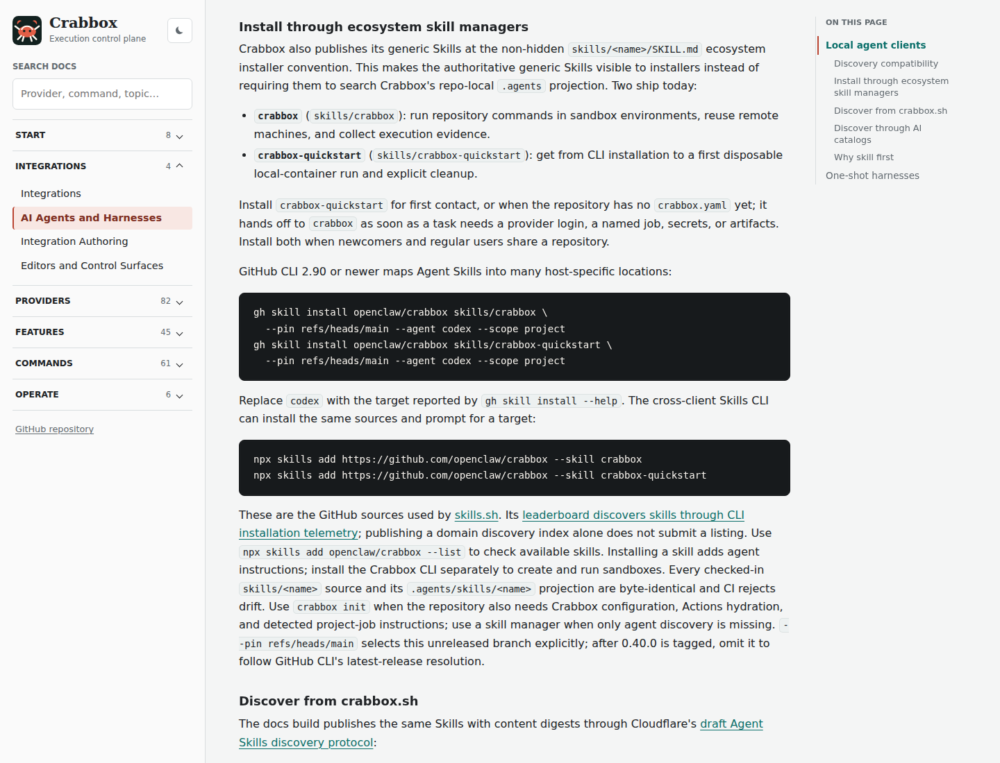
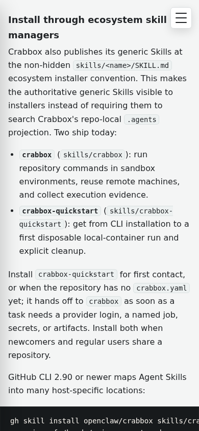

# Sandbox skill installation and browser proof

Source: 16ea048cbd8e570c461f48a2a8ea61ecdd468862 (tree 03103fa64a1176e118c493d6576c7073b3cae6a0).

Generated with the checked-in docs builder, enhancer and scripts/docs-ui-proof.mjs using Playwright 1.55.1 / Chromium 140. Browser result: 169/169 assertions passed. The attached screenshots show the actual generated skill selection guide at desktop 1440x1100 and mobile 390x844. The JSON includes both skill-choice width checks and HTTP download/digest verification for both skills. Other homepage/feature screenshots recorded in the full JSON are omitted from this focused evidence bundle.

Skills CLI 1.5.24 installed both skills into an isolated project with:

```sh
DISABLE_TELEMETRY=1 npx --yes skills add /path/to/updated/crabbox --skill crabbox crabbox-quickstart --agent codex --yes
```

Both installed SKILL.md files compared byte-for-byte equal to their canonical sources. This verifies installation of this revision from a local checkout; it does not establish that the unmerged quickstart is indexed on skills.sh.

Other verification: 19/19 docs publishing/enhancement tests passed; check-agent-skills.mjs passed; check-docs-links.mjs passed for 246 Markdown files; skill-creator quick_validate.py passed; git diff --check passed. Full check-docs.sh could not run its command-help checks because Go is not installed in the workspace. No Go/provider runtime changes were made or claimed tested during this revision.




